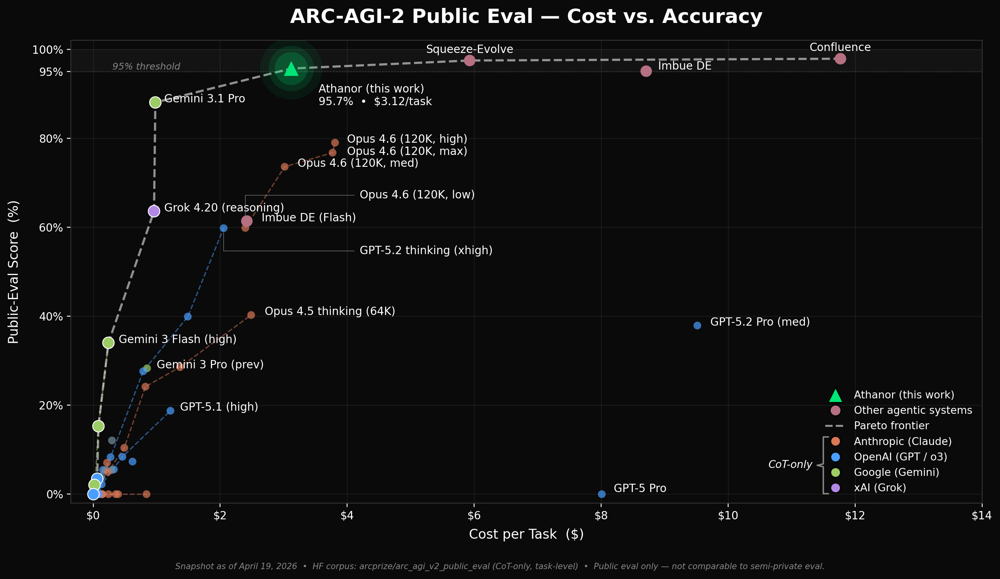

# Athanor

A personal research project on stateful multi-agent orchestration for ARC-AGI-2.

**95.7% on ARC-AGI-2 public evaluation at ~$3 per task** — the lowest cost per task among systems scoring above 95%.



| System | Score | Cost / Task | Method |
|---|---:|---:|---|
| [Confluence](https://github.com/confluence-labs/arc-agi-2) | 97.9% | $11.77 | Program synthesis + vote |
| [Squeeze-Evolve](https://arxiv.org/abs/2604.07725) | 97.5% | $5.93 | Evolutionary recombination |
| [Darwinian Evolver (Imbue)](https://github.com/imbue-ai/darwinian_evolver) | 95.1% | $8.71 | Evolutionary search over programs |
| **This work** | **95.7%** | **$3.12** | **Code-verified hypothesis refinement + independent reviewer** |

See [RESULTS.md](RESULTS.md) for per-task scores, cost breakdown, and hard-pair frontier analysis.

## Approach

Three interlocking mechanisms drive the cost efficiency:

1. **Code as verification.** Exploratory `run_code` calls are separated from final solution submission and serve as a token-efficient verification tool. A short Python snippet that executes and returns a concrete result replaces lengthy chain-of-thought enumeration. This token compression compounds across iterations and is the primary driver of the ~2× cost advantage over pure-LLM systems like Squeeze-Evolve.

2. **Independent artifact-only reviewer.** A fresh model context reviews the solver's hypothesis text, `solve()` code, candidate test predictions, and training accuracy — never the solver's reasoning chain. It issues APPROVE / REJECT / EXPAND_CANDIDATES. Among top ARC systems, this is the only mechanism that can reject a solution that passes training 100% on generalization grounds.

3. **Inter-Agent Artifact Exchange (IAAE).** Each agent maintains its own context and exchanges only *artifacts* (hypothesis, code, verdict) — never reasoning chains. When context fills or the reflector rejects, the solver distills its research state into a portable checkpoint and resumes from it in a fresh context window. On reflector REJECT, compression and feedback injection happen atomically in one turn.

See [docs/design.md](docs/design.md) for the full design rationale and competitive context.

## Quickstart

1. Install dependencies.
```bash
cd /path/to/athanor
python -m venv .venv
source .venv/bin/activate
pip install -U pip
pip install -e .
# For Phoenix observability (optional):
# pip install -e ".[phoenix]"
```

2. Point to the external ARC dataset root (no task JSONs are bundled).
```bash
export ARC_DATA_ROOT=/path/to/ARC-AGI-2
```

3. Set model credentials.
```bash
export ANTHROPIC_API_KEY=...
export GOOGLE_API_KEY=...       # for the Gemini independent reflector
```

4. Launch the web demo (batch dashboard).
```bash
python -m athanor web
# Or pre-spawn instances for specific tasks and auto-start:
# python -m athanor web --tasks 269e22fb a32d8b75 --auto-start
```

5. Open the dashboard URL it prints (default `http://127.0.0.1:7860`). The dashboard hosts one or more solver instances:
   - Click **+** to add a new puzzle instance (leave the task ID blank for a generic instance where you pick the puzzle inside the UI).
   - Inside an instance, pick a task ID and click **Solve**, or load any of the 119 release checkpoints from the dropdown to inspect a finished run.

## Reproducibility

- The web UI's production defaults (`max_turns=200`, `max_test_predictions=2`, `thinking_effort=medium`, `reflection_thinking_effort=max`, `compression_thinking_effort=max`, `compression_threshold=170000`) are the typical settings used to produce the release result. Individual runs across the 119-checkpoint set vary slightly.
- The $3.12 per-task average is the batch-deployment cost: only the first puzzle pays the ~$0.09 cold system-prompt write; subsequent puzzles hit Anthropic's 5-minute prompt cache automatically.
- Each release checkpoint in `release_runs/` embeds its own exact config in `state.config`. Loading one restores the precise settings for that run.
- Model-side nondeterminism may remain depending on provider/runtime.

## Safety

Model-generated Python execution is **unsafe** and intended only for isolated local research environments.

- The web UI enables code execution by default (`unsafe_local_exec = true` in the web config). Model-generated code runs in the local Python process.
- Use a container or VM with minimal privileges and no sensitive files.

See the [Threat Model section of docs/design.md](docs/design.md#threat-model).

## Documentation

- [RESULTS.md](RESULTS.md) — full-eval score, cost analysis, hard-pair frontier
- [docs/design.md](docs/design.md) — design rationale, architecture, competitive context, terminology, threat model
- [docs/zero_solve_subset.md](docs/zero_solve_subset.md) — frozen 2026-04-12 snapshot methodology and reproduction queries

## License

MIT. See [LICENSE](LICENSE).
