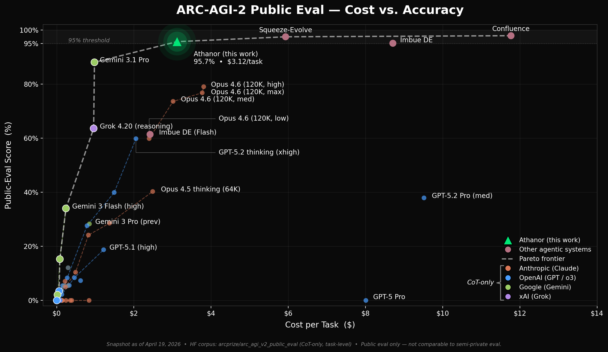

# Athanor

A personal research project on stateful multi-agent orchestration for ARC-AGI-2.

**95.7% on ARC-AGI-2 public evaluation at ~$3 per task** — the lowest cost per task among systems scoring above 95%.



| System | Score | Cost / Task | Method |
|---|---:|---:|---|
| [Confluence](https://github.com/confluence-labs/arc-agi-2) | 97.9% | $11.77 | Program synthesis + vote |
| [Squeeze-Evolve](https://arxiv.org/abs/2604.07725) | 97.5% | $5.93 | Evolutionary recombination |
| [Darwinian Evolver (Imbue)](https://github.com/imbue-ai/darwinian_evolver) | 95.1% | $8.71 | Evolutionary search over programs |
| **This work** | **95.7%** | **$3.12** | **Code-verified hypothesis refinement + independent reviewer** |

See [RESULTS.md](RESULTS.md) for per-task scores, cost breakdown, and hard-pair frontier analysis.

## Approach

Three interlocking mechanisms drive the cost efficiency:

1. **Code as verification.** Exploratory `run_code` calls are separated from final solution submission and serve as a token-efficient verification tool. A short Python snippet that executes and returns a concrete result replaces lengthy chain-of-thought enumeration. This token compression compounds across iterations and is the primary driver of the ~2× cost advantage over pure-LLM systems like Squeeze-Evolve.

2. **Independent artifact-only reviewer.** A fresh model context reviews the solver's hypothesis text, `solve()` code, candidate test predictions, and training accuracy — never the solver's reasoning chain. It issues APPROVE / REJECT / EXPAND_CANDIDATES. Among top ARC systems, this is the only mechanism that can reject a solution that passes training 100% on generalization grounds.

3. **Inter-Context Artifact Exchange (ICAE).** Each agent maintains its own context and exchanges only *artifacts* (hypothesis, code, verdict) — never reasoning chains. When context fills or the reflector rejects, the solver distills its research state into a portable checkpoint and resumes from it in a fresh context window. On reflector REJECT, compression and feedback injection happen atomically in one turn.

See [docs/design.md](docs/design.md) for the full design rationale and competitive context.

## Quickstart

1. Install dependencies.
```bash
cd /path/to/athanor
python -m venv .venv
source .venv/bin/activate
pip install -U pip
pip install -e .
# For Phoenix observability (optional):
# pip install -e ".[phoenix]"
```

2. Point to the external ARC dataset root (no task JSONs are bundled).
```bash
export ARC_DATA_ROOT=/path/to/ARC-AGI-2
```

3. Set model credentials.
```bash
export ANTHROPIC_API_KEY=...
export OPENAI_API_KEY=...       # for OpenAI Responses API models
export GOOGLE_API_KEY=...       # for the Gemini independent reflector
```

4. Launch the web demo (batch dashboard).
```bash
python -m athanor web
# Or pre-spawn instances for specific tasks and auto-start:
# python -m athanor web --tasks 269e22fb a32d8b75 --auto-start
```

5. Open the dashboard URL it prints (default `http://127.0.0.1:7860`). The dashboard hosts one or more solver instances:
   - Click **+** to add a new puzzle instance (leave the task ID blank for a generic instance where you pick the puzzle inside the UI).
   - Inside an instance, pick a task ID and click **Solve**, or load any of the 119 release checkpoints from the dropdown to inspect a finished run.

## Reproducibility

- The web UI's production defaults (`max_turns=200`, `max_test_predictions=2`, `thinking_effort=medium`, `reflection_thinking_effort=max`, `compression_thinking_effort=max`, `compression_threshold=170000`) are the typical settings used to produce the release result. Individual runs across the 119-checkpoint set vary slightly.
- The $3.12 per-task average is the batch-deployment cost: only the first puzzle pays the ~$0.09 cold system-prompt write; subsequent puzzles hit Anthropic's 5-minute prompt cache automatically.
- Each release checkpoint in `release_runs/` embeds its own exact config in `state.config`. Loading one restores the precise settings for that run.
- Model-side nondeterminism may remain depending on provider/runtime.

## Safety

Model-generated Python execution is **unsafe** and intended only for isolated local research environments.

- The web UI enables code execution by default (`unsafe_local_exec = true` in the web config). Model-generated code runs in the local Python process.
- Use a container or VM with minimal privileges and no sensitive files.

See the [Threat Model section of docs/design.md](docs/design.md#threat-model).

## Claude Code as harness (experimental variant)

An exploratory variant in which **Claude Code owns the agent loop** and Athanor
supplies only the workspace, the doctrine, and a verification gate. One solver
agent, no reviewer.

The point is to isolate the thesis from the bespoke loop: code-as-verification,
artifact separation, and budgeted iteration are kept; the custom orchestrator is
replaced by a general-purpose coding agent with a shell and a filesystem.
Exploration becomes `python explore/<name>.py`, the hypothesis and `solve()`
become files, and `arc.verify(claim, condition)` makes "establish it by
executing it" the literal API — with every verified invariant recorded to a
ledger that survives context compaction.

```bash
export ARC_DATA_ROOT=/path/to/ARC-AGI-2
athanor cc run 28a6681f --max-iterations 8      # solve one task
athanor cc batch --tasks 28a6681f 0934a4d8      # solve several
athanor cc score cc_runs                        # aggregate
athanor cc workspace 28a6681f                   # prepare a workspace, launch nothing
```

### Where it stands

**24 completed tasks, 23 fully solved, 33 of 34 test examples**, ~1.2 formal
iterations per task, zero gate refusals across the whole experiment. That
includes `faa9f03d`, which no logged submission in the frozen public corpus had
ever solved in 127 attempts.

Read that percentage with care: the 23 tasks were **chosen for difficulty**, not
sampled — six of the eight zero-solve frontier puzzles and all five puzzles the
flagship itself fails — so it says nothing about the other 97 public-eval tasks.
The numbers worth comparing are the head-to-head ones, on identical puzzles:

| | this variant | flagship |
|---|---|---|
| zero-solve frontier (9 pairs) | **8** | 8 |
| pairs the flagship itself fails (6) | **6** | 0 |
| cost per task (n=4 batch) | $1.86 | $3.12 mean / $1.71 median |

The two systems fail on *different* puzzles: each solves exactly one frontier
pair the other cannot, and between them the whole frontier falls. This variant
carries no reviewer, no second model and no inter-agent artifact exchange.

An ablation — doctrine stripped from the workspace contract, toolkit left intact
— found that agents adopt the practice anyway: told nothing about verification
or hedging, they read `arc.py` and register rivals, sweep ties and hedge. The
portable part appears to be the toolkit rather than the system prompt.

See [docs/cc_harness.md](docs/cc_harness.md) for the mechanism-by-mechanism
mapping, what is deliberately dropped, and the open questions the variant exists
to answer, and [docs/cc_harness_results.md](docs/cc_harness_results.md) for the
running experiment log — including the negative results, of which there are
several.

## ARC-AGI-3: an agent as the player (CCARC3)

A separate line of work in this repository. ARC-AGI-3 is not the
grid-transduction task — it is a set of small interactive games played over an
HTTP API, one action at a time, where the player must infer the mechanics from
what the board does. `src/athanor/ccarc3/` is a harness for running an agent as
that player: an HTTP client and action ledger, grid primitives, three-valued rule
checking, RHAE scoring with card corroboration, and a clean-rollout discipline
that discards runs which are not results.

**Porting it to another harness: start at
[docs/ccarc3_port_guide.md](docs/ccarc3_port_guide.md).** It separates the five
modules that are pure ARC-AGI-3 domain logic (no harness dependency) from the
parts that only make sense under Claude Code, and records the scoring invariants
that produce plausible-looking wrong numbers when inverted — the environment is
scored on its *best* play rather than its last, `actions_by_level` is cumulative
rather than per-level, an action belongs to the level it was taken *from*, and
the play-opening RESET is not billed while a post-death RESET is. Each was
established against the live API or a real trace.

The domain modules carry a re-runnable mutation battery —
`tools/mutation_battery_ccarc3.py`, 147 mutants across five modules — because
the defect this project keeps producing is a check that names a thing and reads
a proxy for it, and the signature is that it passes by not running.

## Documentation

- [RESULTS.md](RESULTS.md) — full-eval score, cost analysis, hard-pair frontier
- [docs/design.md](docs/design.md) — design rationale, architecture, competitive context, terminology, threat model
- [docs/cc_harness.md](docs/cc_harness.md) — the Claude Code harness variant: mechanism mapping, gate contract, open questions
- [docs/cc_harness_results.md](docs/cc_harness_results.md) — the variant's experiment log: round-by-round results, every harness defect found and fixed, and the negative results
- [docs/zero_solve_subset.md](docs/zero_solve_subset.md) — frozen 2026-04-12 snapshot methodology and reproduction queries
- [docs/ccarc3_port_guide.md](docs/ccarc3_port_guide.md) — ARC-AGI-3 harness: what ports, the scoring invariants, the audit method, and what is *not* established
- [docs/ccarc3_codex_handoff_20260812.md](docs/ccarc3_codex_handoff_20260812.md) — current Codex-port state, new-machine setup, verified live result, evidence transfer, and safe continuation boundary
- [docs/ccarc3_design.md](docs/ccarc3_design.md) — ARC-AGI-3 design note and open questions
- [docs/ccarc3_open_findings.md](docs/ccarc3_open_findings.md) — every ARC-AGI-3 audit finding, with the argument for each

## Tests

```bash
pip install -e ".[dev]"
pytest
```

## License

MIT. See [LICENSE](LICENSE).
